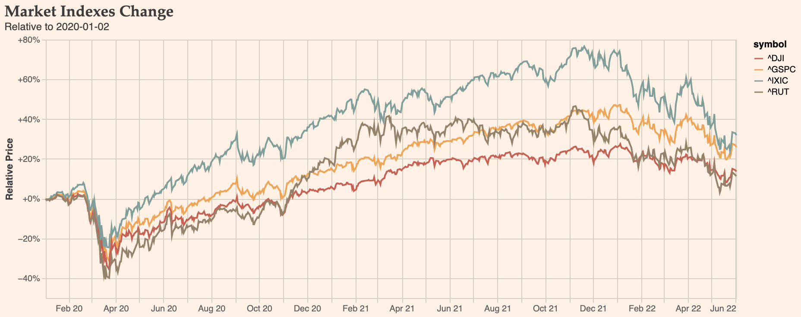
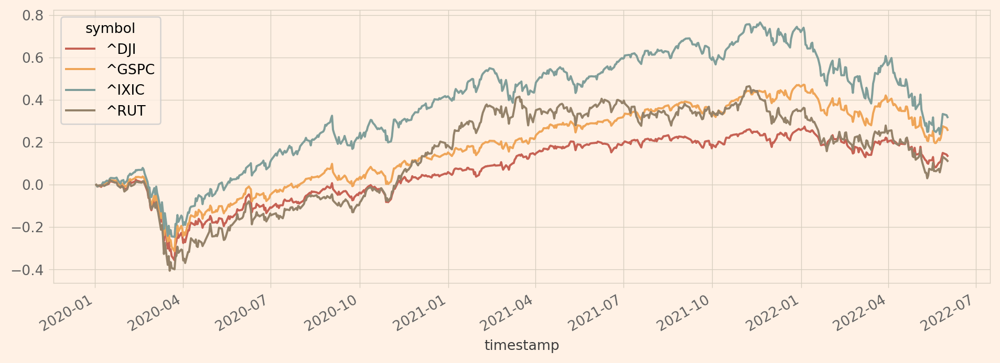

# themes
> _themes: style once, plot everywhere_

Universal theme styling across the different python visualization libraries. The package also contains out-of-the-box themes (e.g., a financial news theme) for instant use.

## Quickstart

```python
import themes
from themes import datasets

themes.register()
markets = datasets.load_markets()
```

```python
with alt.themes.enable('capon'):
    chart = alt.Chart(markets).mark_line().encode(
        x=alt.X('timestamp', title=None, axis=alt.Axis(format="%b %y")),
        y=alt.Y('relative_price', title="Relative Price", axis=alt.Axis(format='+%')),
        color='symbol',
        tooltip=['timestamp', 'symbol', alt.Tooltip('relative_price', format='+.2%')],
    ).properties(
        title={
            "text": f"Market Indexes Change",
            "subtitle": f"Relative to {markets['timestamp'].dt.date.min()}",
        },
```


```python
with plt.style.context('capon'):
    markets.pivot_table(index='timestamp', columns='symbol', values='relative_price').plot()
```


The full example in a live notebook is provided [below](#examples).

## Installing
### Install latest release version via [pip](https://pip.pypa.io/en/stable/quickstart/)
```bash
$ pip install themes
```

### Install latest development version via [pip](https://pip.pypa.io/en/stable/quickstart/)
```bash
pip install git+https://github.com/gialdetti/themes.git
```

### Install latest development version in development mode
```bash
git clone git@github.com:gialdetti/themes.git
cd themes
pip install -e .
```

## Help and Support

### Examples
All examples are located in [examples](examples) folder.

|     Theme    |   MyBinder   | Colab |
| ------------ | :----------: | :---: |
| [Markets](https://nbviewer.jupyter.org/github/gialdetti/themes/blob/main/examples/plot-markets.ipynb) | [](https://mybinder.org/v2/gh/gialdetti/themes/main?filepath=examples/plot-markets.ipynb) | [](https://colab.research.google.com/github/gialdetti/themes/blob/main/examples/plot-markets.ipynb) | 

### Testing
After installation, you can launch the test suite:
```bash
$ pytest
```
